# <p align="center">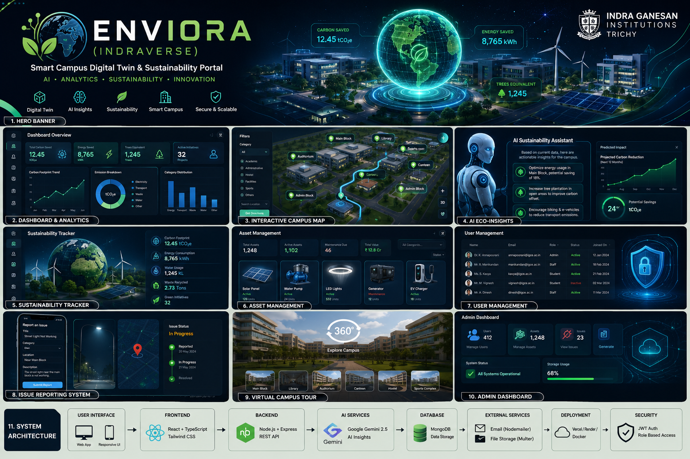</p>

<p align="center">
  
  
  
  
  
</p>

<p align="center">
  
  
  
  
  
</p>

---

## 🌟 Project Overview

**Enviora (IndraVerse)** is a cutting-edge, spatial digital twin and real-time sustainability monitoring portal built specifically for the **Indra Ganesan Institutions** in Trichy, India. Combining real-time asset telemetry, GIS spatial mapping, 360-degree virtual tours, and artificial intelligence, Enviora acts as a digital twin command center to auditor, manage, and optimize the campus's carbon footprint, energy grids, water consumption, and waste systems.

Powered by the **Google Gemini 2.5 Flash** model, Enviora offers smart, data-driven sustainability audits, automatically generating actionable carbon-reduction recommendations tailored to specific campus infrastructure like solar arrays, smart LED grids, EV chargers, and water pump systems.

---

## 📸 AI Hero & Visual Showcase

<p align="center">
  
  <br>
  <i>Futuristic digital twin modeling showing carbon analytics, holographic GIS campus overlays, and clean renewable energy distribution systems.</i>
</p>

---

## 🚀 Key Features

### 📊 Real-Time Sustainability Dashboard
- **Telemetry Indicators**: Tracks total Carbon Saved ($tCO_2e$), Energy Saved ($kWh$), and Trees Equivalent.
- **Trend Charts**: Dynamic graphs powered by **Recharts** plotting monthly emissions breakdown across electricity, transport, waste, and water.
- **Green Scores**: Live health indices for each campus institution based on utility telemetry.

### 🗺️ GIS-Powered Interactive Campus Map
- **Digital Twin Visualization**: Built on **Leaflet.js**, mapping campus buildings (Auditorium, Main Block, Library, Hostels, Canteen, Admin Block).
- **Asset Layers**: Filterable overlays showing the location of solar panels, water pumps, generators, and EV chargers.
- **Routing Engine**: Visual pathfinding between blocks powered by **Leaflet Routing Machine**.

### 🤖 AI Eco-Insights
- **Audit Reports**: Integrated with the **Google Gen AI SDK (`@google/genai`)** using the **Gemini 2.5 Flash** model.
- **Contextual Prompting**: Synthesizes real-time asset status into JSON-structured, actionable engineering suggestions (e.g., HVAC load balancing, solar cell degradation warnings).
- **Dynamic Fallbacks**: Local heuristics engine that generates smart recommendations if the external Gemini API is unreachable.

### 🕒 Immersive 360° Virtual Campus Tour
- **Virtual Panorama Viewer**: Embedded canvas rendering 360-degree high-definition panorama images.
- **Interactive Hotspots**: Instant teleportation between key campus sites like the Library, Auditorium, Hostel, and Canteen.

### ⚡ Smart Asset & User Management
- **Device Telemetry**: Comprehensive tables detailing capacity, status (Active/Maintenance/Inactive), and logs for all physical hardware.
- **Role-Based Access (RBAC)**: Fine-grained security modes for Administrators, Staff, and Students.
- **Excel Data Pipeline**: Seamless user/asset directory imports and exports via **ExcelJS**.

---

# 📸 Project Modules

---

## 📊 Dashboard Panel

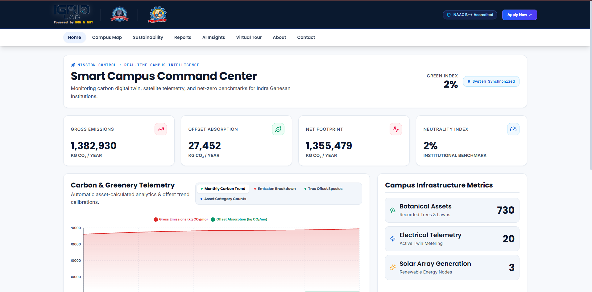

Provides a real-time overview of campus sustainability metrics, carbon emissions, energy consumption, and environmental analytics through interactive dashboards.

---

## 🗺️ Campus Map Panel


Interactive Digital Twin GIS Map powered by Leaflet.js with navigation, building information, and smart campus routing.

---

## 🤖 AI Eco Insights Panel


Google Gemini AI analyzes sustainability data and generates intelligent recommendations for reducing carbon emissions.

---

## 🌱 Sustainability Panel

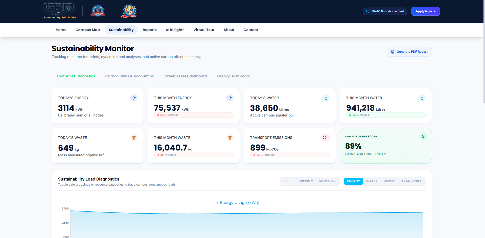

Tracks daily energy usage, water consumption, waste management, carbon footprint, and environmental performance indicators.

---

## 🚨 Issue Reporting Panel

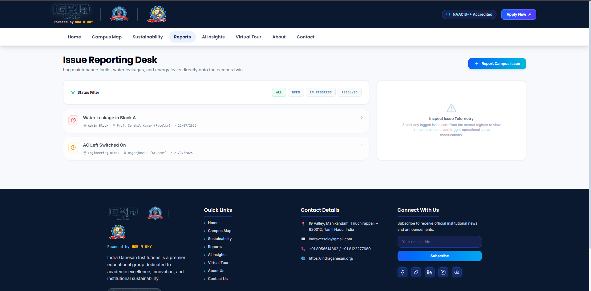

Students and staff can report campus issues with images, location, priority, and live status tracking.

---

## 🎥 Virtual Tour Panel

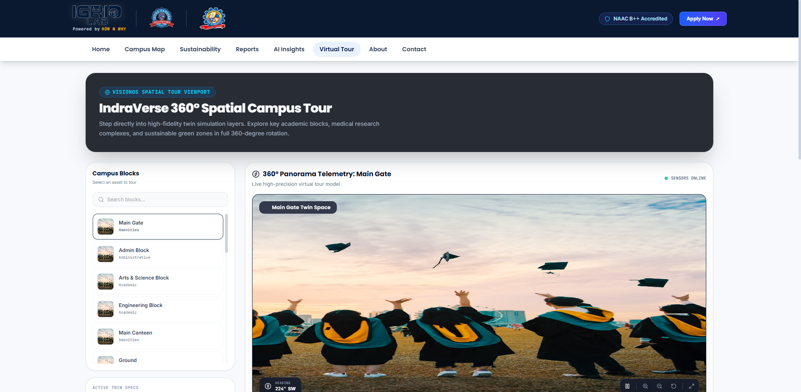

Provides a 360° immersive virtual tour of the campus with interactive navigation and panoramic views.

---

## 🛠️ Admin Panel

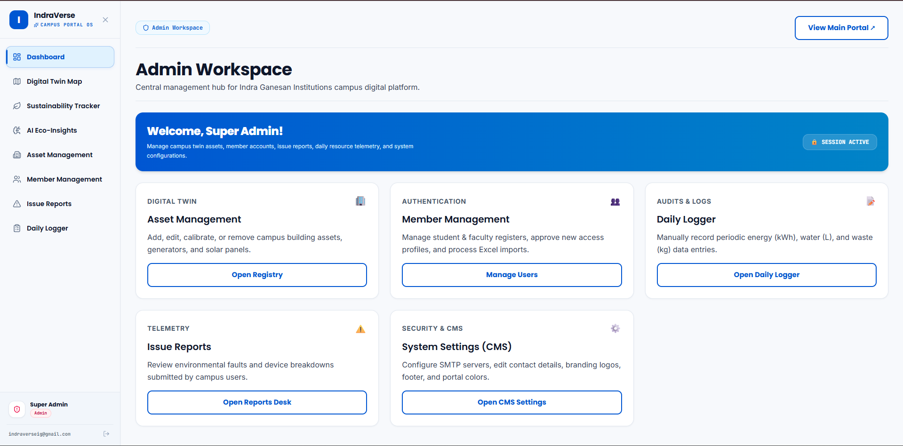

Centralized administrative dashboard for managing users, assets, sustainability records, reports, and system settings.

---

## 🔐 Login Page

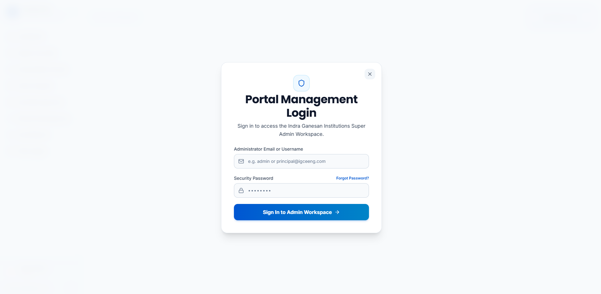

Secure authentication system with role-based access control for administrators, faculty, and students.

---

## 📞 Contact Us

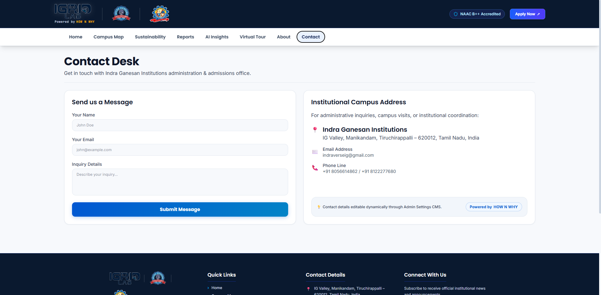

Provides institutional contact information, support details, and enquiry submission forms.

---

## ℹ️ About Us

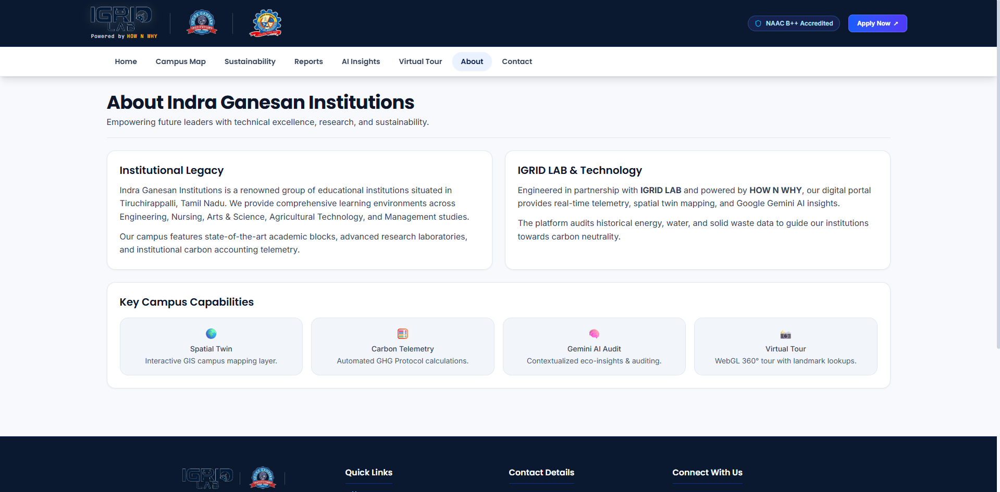

Introduces Indra Ganesan Institutions, highlighting the vision, mission, campus facilities, and commitment to sustainability.

## 🏗️ System Architecture

<p align="center">
  
</p>

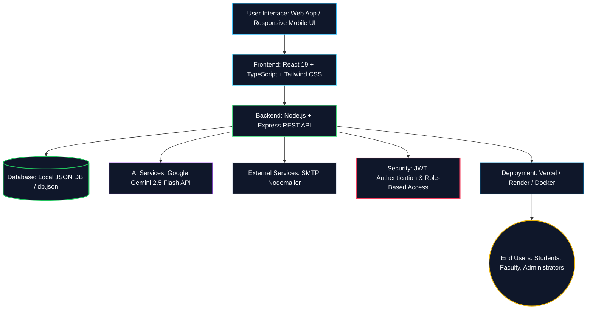

---

## ⚙️ Tech Stack & Dependencies

### Frontend Core
- **Framework**: React 19 (Vite-bundler)
- **Styling**: Tailwind CSS v4 (native CSS configuration)
- **Interactions & Animations**: GSAP (GreenSock), Motion, React Parallax Tilt
- **Mapping**: Leaflet JS & Leaflet Routing Machine (GIS map routing)
- **Charts**: Recharts (Carbon trends & distributions)

### Backend Core
- **Runtime**: Node.js & Express (TypeScript compiled with esbuild and tsx)
- **Security**: Helmet, Express Rate Limit, bcryptjs, JSON Web Tokens (JWT)
- **Services**: Multer (File uploads), ExcelJS (Spreadsheet imports/exports), Nodemailer (Alert dispatch)
- **AI Core**: Google Gen AI SDK (`@google/genai` library invoking `gemini-2.5-flash`)

---

## 📁 Repository Directory Structure

```text
indraverse-portal/
├── .aistudio/               # AI Studio configuration files
├── assets/                  # Public assets
│   └── ai/                  # REDESIGNED: Redesigned premium assets & screen crops
│       ├── enviora-thumbnail.png            # Generated AI Thumbnail
│       ├── hero-banner.png                  # Crop: Hero Banner
│       ├── dashboard-thumbnail.png          # Crop: Dashboard
│       ├── campus-map-thumbnail.png         # Crop: Campus Map
│       ├── ai-insights-thumbnail.png        # Crop: AI Eco Insights
│       ├── sustainability-thumbnail.png     # Crop: Sustainability
│       ├── asset-management-thumbnail.png   # Crop: Asset Management
│       ├── user-management-thumbnail.png    # Crop: User Management
│       ├── issue-reporting-thumbnail.png    # Crop: Issue Reporting
│       ├── virtual-campus-tour-thumbnail.png # Crop: Virtual Campus Tour
│       ├── admin-dashboard-thumbnail.png    # Crop: Admin Dashboard
│       └── system-architecture-banner.png   # Crop: System Architecture
├── dist/                    # Compiled production build assets
├── src/                     # React frontend source code
│   ├── assets/              # Raw frontend static assets (logos, original banner)
│   ├── components/          # Reusable React components & panel pages
│   │   ├── AdminSettings.tsx       # System settings, notifications, diagnostics
│   │   ├── AiInsights.tsx          # Real-time Gemini audit recommendations
│   │   ├── AssetManagement.tsx     # Asset catalog, maintenance planner
│   │   ├── CampusMap.tsx           # Leaflet GIS-powered Interactive Campus Map
│   │   ├── DailySustainabilityLogger.tsx # Operational telemetry logger
│   │   ├── Dashboard.tsx           # Executive carbon overview & graph analytics
│   │   ├── IssueReporter.tsx       # Issue submission form & ticket tracking
│   │   ├── PanoramaViewer.tsx      # 360-degree panorama render engine
│   │   ├── UserManagement.tsx      # Contributor profile controls & directory
│   │   └── VirtualCampusTour.tsx   # 360 Virtual Campus Tour screen
│   ├── data/                # Mock data & initial coordinates configuration
│   ├── types/               # TypeScript interfaces & types schemas
│   └── utils/               # App helper modules (CMS store, sustainability computations)
├── server.ts                # Express backend entry point (API router & static file server)
├── tsconfig.json            # TypeScript configuration compiler options
├── vite.config.ts           # Vite Bundler configuration file
├── db.json                  # Local JSON data store (Database)
├── package.json             # NPM package manifest (dependencies & tasks)
└── .env                     # App environment configuration (ignored from git)
```

---

## 🛠️ Installation & Setup

Follow these simple steps to run Enviora locally on your development machine:

### Prerequisites
- [Node.js](https://nodejs.org/) (Version >= 18 recommended)
- [NPM](https://www.npmjs.com/) (installed automatically with Node)

### Step 1: Clone the Repository
```bash
git clone https://github.com/yourusername/indraverse.git
cd indraverse
```

### Step 2: Install Node Dependencies
```bash
npm install
```

### Step 3: Configure Environment Variables
Create a `.env` file in the root directory by copying the example:
```bash
cp .env.example .env
```
Open the `.env` file and insert your configuration details:
```ini
GEMINI_API_KEY="AIzaSyYourGeminiAPIKeyHere"
APP_URL="http://localhost:3000"
SMTP_HOST="smtp.gmail.com"
SMTP_PORT=587
SMTP_USER="your-email@gmail.com"
SMTP_PASS="your-gmail-app-password"
SMTP_SECURE=false
EMAIL_FROM="IndraVerse <your-email@gmail.com>"
JWT_SECRET="your-custom-jwt-secret-string"
```

### Step 4: Run the Application in Development Mode
This starts the backend Express server which also serves the frontend Vite application with hot-module reloading:
```bash
npm run dev
```
Open your browser and navigate to `http://localhost:3000`.

### Step 5: Build for Production
To build the application for deployment:
```bash
npm run build
```
Start the production server:
```bash
npm start
```

---

## 📊 Environment Variables Detail

| Environment Variable | Description | Default / Example | Required |
| :--- | :--- | :--- | :---: |
| `GEMINI_API_KEY` | Google AI Studio key to enable the automated LLM-based sustainability recommendation engine. | `AIzaSy...` | Optional (falls back to local data-driven rules) |
| `APP_URL` | Self-referential URL where the application server is reachable. | `http://localhost:3000` | **Yes** |
| `SMTP_HOST` | Host address of SMTP server for outgoing issue-report notifications. | `smtp.gmail.com` | **Yes** |
| `SMTP_PORT` | Port number of target SMTP server (usually 587 for TLS, 465 for SSL). | `000` | **Yes** |
| `SMTP_USER` | Email username used to authenticate with SMTP host. | `indraverseig@gmail.com` | **Yes** |
| `SMTP_PASS` | Password or App Password for SMTP authentication. | `your account password` | **Yes** |
| `SMTP_SECURE` | Set to `true` if your SMTP host requires secure SSL/TLS. | `false` | **Yes** |
| `EMAIL_FROM` | The sender address header injected in dispatched alert mail headers. | `IndraVerse <indraverseig@gmail.com>` | **Yes** |
| `JWT_SECRET` | Secret key string used to encrypt JWT login session tokens. | `my-super-key-board` | **Yes** |

---

## 🔄 Project Workflow Flowchart

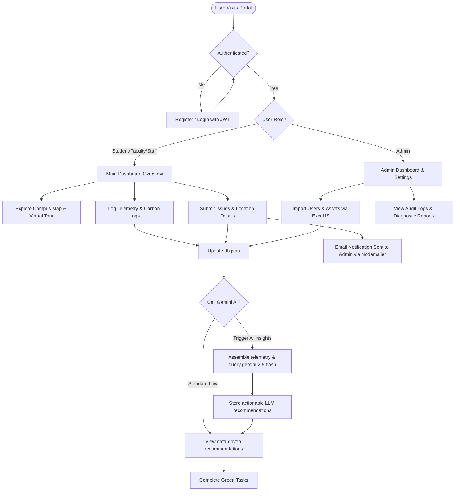

---

## 🤖 AI Core: Gemini Integration Details

The core intelligence of Enviora is driven by **Google Gemini 2.5 Flash**, configured via the official `@google/genai` library.

### 1. Data-Driven Prompt Formulation
Whenever an administrator or auditor triggers the `/api/ai/insights` endpoint, Enviora retrieves the latest telemetry readings of active campus assets (Solar Panels, Water Pumps, EV Chargers, LED grids) and compiles them into a structured prompt:
```typescript
const assetsSummary = activeAssets.map(a => 
  `- Name: ${a.name}, Institution: ${a.institution}, Category: ${a.category}, Green Score: ${a.greenScore}%, Energy: ${a.energyUsage} kWh, Water: ${a.waterUsage} L, Waste: ${a.wasteGenerated} kg.`
).join('\n');
```

### 2. Structured Output Enforcement
The prompt explicitly instructs the Gemini model to perform a carbon audit and respond strictly with a valid JSON schema containing the following fields:
```json
{
  "category": "Energy" | "Water" | "Waste" | "Greenery",
  "title": "A short descriptive, professional title",
  "description": "Analysis and proposed engineering solution tailored to one of the named assets.",
  "savingsPotential": "Estimated savings with units",
  "impactLevel": "High" | "Medium" | "Low"
}
```

### 3. Graceful Fallback Mode
If no `GEMINI_API_KEY` environment variable is defined or the Google API server is unavailable, the application automatically switches to a local rule-based algorithm. This fall-back system audits active assets mathematically, outputting contextual eco-recommendations locally, ensuring zero downtime.

---

## 🌱 Sustainability Algorithms & Mechanics

Enviora implements standard environmental metrics to calculate carbon equivalents:

- **Carbon Footprint Calculation**: Total greenhouse gas emissions are calculated using localized coefficient factors:
  - **Electricity**: $1 \text{ kWh} \approx 0.82 \text{ kg } CO_2$ (standard Indian electricity grid intensity).
  - **Generator Fuel**: $1 \text{ Litre Diesel} \approx 2.68 \text{ kg } CO_2$.
  - **Waste Landfill**: $1 \text{ kg Waste} \approx 1.25 \text{ kg } CO_2$.
  - **Water Distribution**: $1 \text{ KL Water} \approx 0.34 \text{ kg } CO_2$ (due to pump electricity).
- **Tree Equivalent Offset**: Standard mature trees absorb approximately $22 \text{ kg } CO_2$ per year. The tree equivalent metric in the dashboard is calculated as:
  $$\text{Trees Equivalent} = \frac{\text{Carbon Saved in kg}}{22}$$
- **Green Score Formula**: A normalized rating between 0% and 100% computed across energy efficiency, water conservation rates, waste recycling statistics, and green zone allocations.

---

## 🔮 Future Development Scope

| Horizon | Core Card | Intended Impact |
| :--- | :--- | :--- |
| **🤖 IoT Automation** | **Direct Hardware Coupling** | Integrate MQTT telemetry listeners linking solar inverters, smart meters, and campus water flow sensors directly to the Express backend. |
| **📍 AR Spatial Map** | **WebXR Augmented Layer** | View real-time efficiency metrics by pointing a mobile device camera at physical buildings using augmented reality overlays. |
| **🔗 Block-Ledger** | **Audit Transparency** | Register carbon offset records onto an immutable ledger for official accreditation and national hackathon submissions. |
| **⚡ Smart Load Shed** | **Active Grid Switching** | Utilize predictive AI to automatically switch campus building blocks to solar batteries during peak grid rate tariffs. |

---

## 👥 Engineering Team & Contributors

- **Project Lead & UI Architect**: [Your Name / GitHub Profile]
- **Full-Stack & AI Systems Lead**: [Contributor Name / Profile]
- **Indra Ganesan Institutions Advisory**: Special thanks to the administration of Indra Ganesan Group of Institutions (Trichy) for academic facilitation and dataset references.

---

<p align="center">
  <b>Built with ❤️ for Indra Ganesan Institutions</b>
</p>
# Campus-Carbon-Footprint-Dashboard

# Campus-Carbon-Footprint-Dashboard

